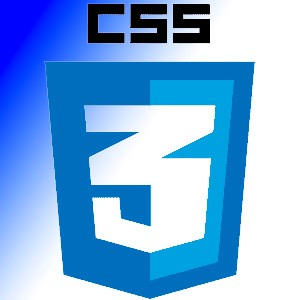
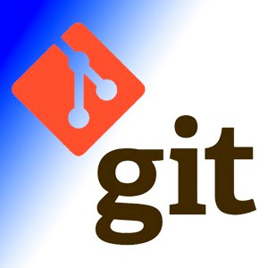
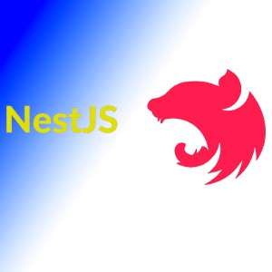

<h1 align="center">Привет всем, меня зовут<a href="https://github.com/Stanislav-D-01" target="_blank](https://github.com/Stanislav-D-01)"> Стас ✌️</a></h1>
 Немного обо мне:

- 🔭 Я вижу себя в будущем крутым разработчиком, сейчас я тоже неплох 😎
- 🌱 Моя цель: вперед и только вперед
- 👯 Хочу работать в крутом коллективе
- 🤔 Люблю когда сложно и мозг кипит
- 😄 Главное в жизни позитив :)

 ### 🚛: Мой стек технологий:

 

### :writing_hand: Мои проекты:
- [Путешествия по России](https://stanislav-d-01.github.io/russian-travel/)
- [Проект добавления фото мест "Место"](https://stanislav-d-01.github.io/mesto-project/)
- [CRA Приложение "Звездные бургеры](https://stanislav-d-01.github.io/react-burger/)
- [Бэк к сайту "Место"](https://github.com/Stanislav-D-01/mesto-project-plus)
- [Бэк к сайту виш листов подарков "Купи подари дай"](https://github.com/Stanislav-D-01/mesto-project-plus)
### :fire: Моя статистика :

